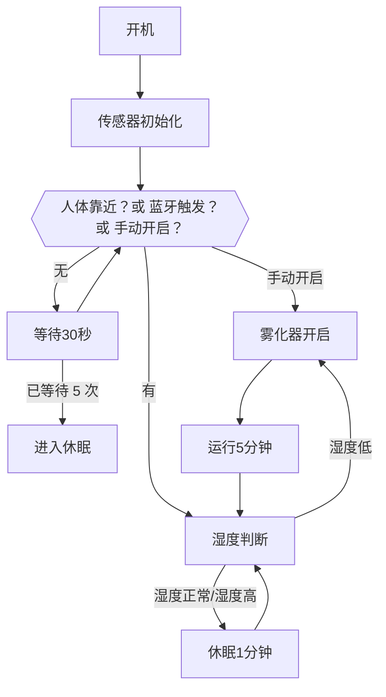
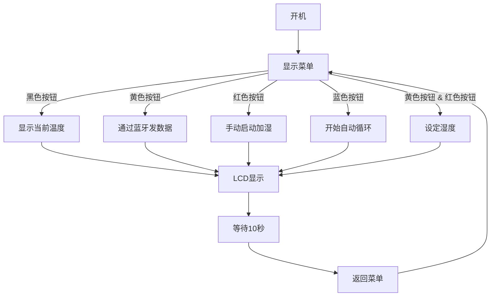

# Fountain Gate

## 项目信息

- 作者：HappyArmor
- 创建时间：2025年6月
- 最后更新：2025-07-14
- 项目阶段：开发中 / 原型测试阶段

## Project Overview

1. 项目目的
   1. 创建个人项目，通过解决实际问题积累工程项目的经验。
   2. 通过运用C++编程语言，将传感器数据接入Arduino。实现加湿器开关的自动化。
2. 功能简要
   1. 自动加湿
   2. 湿度检测
   3. 喷泉与雾化整合
   4. **水位检测**

## 硬件组成

| 模块名称      | 作用说明                           | 关键接口/电压 |
|---------------|------------------------------------|----------------|
| 1602A LCD     | 显示菜单与传感器数据               | 5V / I2C或并口 |
| BC417143B 蓝牙 | 控制系统远程开关 / 数据上传         | 串口通信 |
| HC-SR501      | 检测是否有人靠近，唤醒系统         | 数字信号输出 |
| DHT11         | 检测温湿度                         | 数字信号（单总线） |
| 555 Timer     | 提供周期信号，控制判断频率         | 5V / TTL |
| MOSFET 控制器 | 控制雾化器 / 水泵供电               | 受控开关 |
| 水泵+雾化器   | 执行实际的加湿与喷泉效果             | 5V/12V DC |

## 系统逻辑设计

### 功能逻辑

若人体感应模块*HC-SR501*检测到有人靠近/蓝色按钮=1/*BC417143B*蓝牙接收=1 ，系统开始读取*DHT11*数值
    LCD 显示将被唤醒，显示当前温度数值
    若检测到湿度低于设定阈值，系统通过 MOSFET 控制 DEVANTI 雾化器的电源，实现雾化功能的开关控制。
    运行 2分钟后 (555 timer)
        若检测到湿度低于设定阈值，系统会控制 MOSFET 打开 DEVANTI 雾化器。
        否则关闭，雾化器

若红色按钮输出是1
    进入手动控制菜单界面。按钮选择菜单手动 启动/关闭 加湿器

### I/O

1. Input Module
   1. *HC-SR501*
   2. *BC417143B*
   3. *555 Timer*
   4. *物理按钮*

2. Output Module
   1. *1602A*
   2. LED light
   3. 雾化器

### 状态转换说明

本系统采用基于状态机的控制逻辑，共有五个状态：

1. **休眠状态**：无操作且无人靠近时，关闭雾化器、水泵、屏幕和灯光。
2. **激活状态**：HC-SR501 检测到人体靠近，系统进入唤醒状态，显示菜单。
3. **自动加湿状态**：湿度低于设定值，自动开启雾化器和水泵，维持湿度。
4. **手动控制状态**：用户手动操作菜单，自主控制每个功能。
5. **设置状态**：允许用户修改湿度阈值和工作模式。

系统状态转换逻辑如下：

- 休眠 → 激活：人体感应触发, 手动/蓝牙触发
- 激活 → 自动加湿：湿度低于阈值
- 自动加湿 → 激活：湿度升高
- 激活 → 手动控制：菜单切换
- 任意状态 → 休眠：长时间无操作

## Flow chart

### automatic part

### manual part

## 预计功能扩展/风险与问题点

| 功能 | 描述 | 状态 |
|------|------|------|
| 蓝牙上传数据 | 向电脑/手机发送温度信息 | 待开发 |
| 状态指示灯 | 不同颜色指示不同状态 | 规划中 |
| 水位警报 | 水位过低发出声音提示 | 可选功能 |
