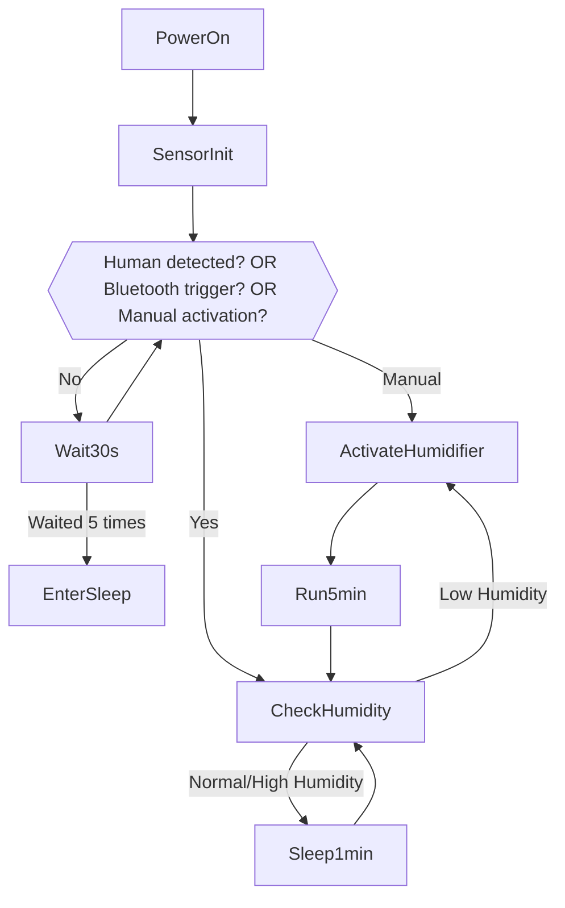
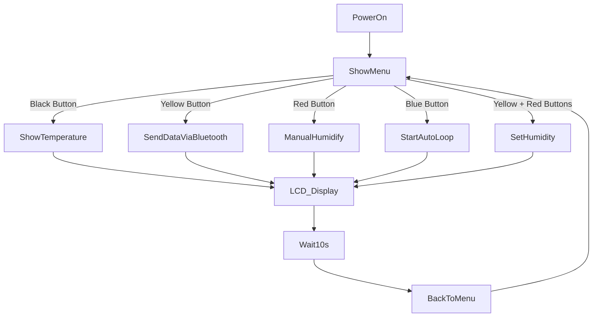

# Fountain Gate

## Project Information

* **Author**: HappyArmor
* **Created**: June 2025
* **Last Updated**: July 14, 2025
* **Project Status**: In Development / Prototype Testing Phase

## Project Overview

1. **Project Goals**

   * Create a personal engineering project to gain hands-on experience by solving real-world problems.
   * Use the C++ programming language to connect sensor data to an Arduino and automate humidifier control.

2. **Key Features**

   * Automatic humidification
   * Humidity detection
   * Integration of fountain and mist generation
   * **Water level monitoring**

## Hardware Components

| Module                  | Description                                     | Interface / Voltage   |
| ----------------------- | ----------------------------------------------- | --------------------- |
| 1602A LCD               | Displays menus and sensor data                  | 5V / I2C or Parallel  |
| BC417143B Bluetooth     | Remote control & data upload                    | Serial Communication  |
| HC-SR501                | Detects human presence and wakes system         | Digital Output        |
| DHT11                   | Measures temperature and humidity               | Digital (Single-wire) |
| 555 Timer               | Generates periodic signal for logic timing      | 5V / TTL              |
| MOSFET Driver           | Controls power to mist generator/pump           | Switched output       |
| Water Pump + Mist Maker | Performs actual humidifying and fountain effect | 5V / 12V DC           |

## System Logic Design

### Functional Logic

When the human presence sensor (*HC-SR501*) detects movement / blue button = 1 / *BC417143B* Bluetooth receives signal = 1:

* The system starts reading data from *DHT11*
* LCD wakes up and displays the current temperature
* If the detected humidity is below the threshold, the system controls the power to the DEVANTI mist generator via a MOSFET to activate misting.
* After running for 2 minutes (controlled by 555 timer):

  * If humidity is still below the threshold, the mist generator remains on
  * Otherwise, the mist generator is turned off

If the red button is pressed:

* The system enters manual control menu
* Users can manually toggle the humidifier on/off through the menu

### I/O Modules

1. **Input Modules**

   * *HC-SR501*
   * *BC417143B*
   * *555 Timer*
   * Physical buttons

2. **Output Modules**

   * *1602A LCD*
   * LED indicators
   * Mist generator

### State Transition Description

The system adopts a state-machine-based control logic with five defined states:

1. **Sleep State**: When idle and no one is nearby, mist generator, pump, screen, and lights are all off.
2. **Active State**: Triggered by HC-SR501 detecting presence, system wakes up and displays menu.
3. **Auto-Humidify State**: If humidity is below threshold, mist generator and pump activate to increase humidity.
4. **Manual Control State**: User manually controls all functions via menu.
5. **Settings State**: Allows user to adjust humidity threshold and operating mode.

**State Transition Logic**:

* Sleep → Active: Human detected / manual trigger / Bluetooth trigger
* Active → Auto-Humidify: Humidity below threshold
* Auto-Humidify → Active: Humidity rises above threshold
* Active → Manual Control: User switches via menu
* Any → Sleep: Prolonged inactivity

## Flowchart

### Automatic Operation

### Manual Operation

## Planned Features / Risks and Issues

| Feature                | Description                        | Status          |
| ---------------------- | ---------------------------------- | --------------- |
| Bluetooth Data Upload  | Send temperature data to PC/phone  | To be developed |
| Status Indicator Light | LED color to indicate system state | In planning     |
| Water Level Alarm      | Sound alert when water is low      | Optional        |